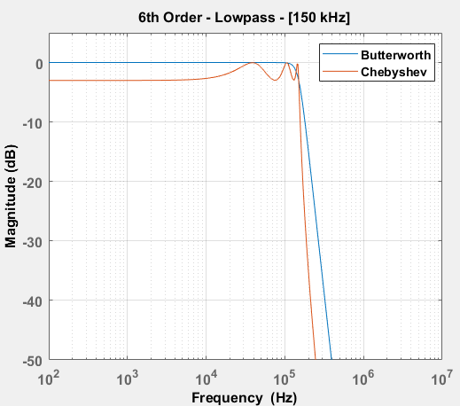
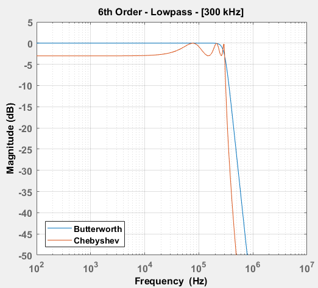
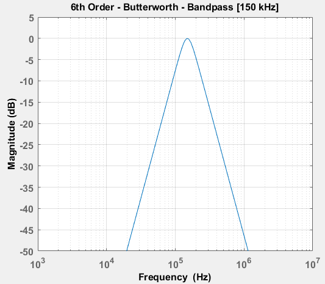
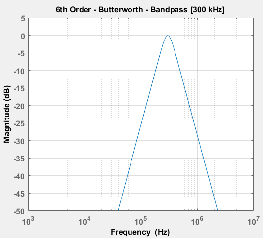

# AnalogFilters-Frequency-Response
Frequency response plots for Butterworth and Chebyshev filters generated using MATLAB. 

## Frequency Reponses 
The following plots have been generated using the MATLAB scripts included in this repository:  

## Output Calculations
The following file contains the output results from the calculations performed in the scripts: 
[[Output_File]](images/Design_Output.txt)
